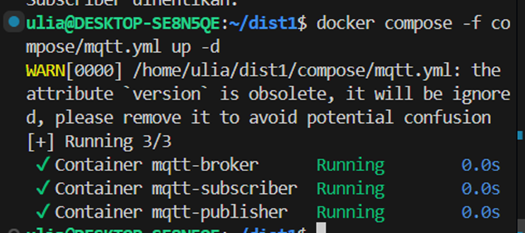

# MQTT

## Pengertian

**MQTT (Message Queuing Telemetry Transport)** adalah protokol komunikasi berbasis *publish-subscribe* yang ringan. MQTT digunakan untuk komunikasi data pada jaringan dengan keterbatasan bandwidth, misalnya dalam aplikasi IoT.

Arsitektur MQTT terdiri dari: **Publisher → Broker → Subscriber**.

---

## Langkah Praktik

### 1. Menjalankan Broker, Publisher, dan Subscriber


```bash
docker compose -f compose/mqtt.yml up -d
```

Output yang dihasilkan akan menampilkan tiga container berjalan:

* `mqtt-broker`
* `mqtt-subscriber`
* `mqtt-publisher`

---

### 2. Menjalankan Publisher

Publisher mengirimkan data suhu secara periodik ke broker.

```bash
docker compose -f compose/mqtt.yml exec mqtt-pub python pub.py
```

Contoh output:

```
Published: Suhu: 28°C
Published: Suhu: 28°C
...
```

---

### 3. Menjalankan Subscriber

Subscriber menerima pesan dari broker berdasarkan topik yang telah didaftarkan.

```bash
docker compose -f compose/mqtt.yml exec mqtt-sub python sub.py
```

Contoh output:

```
Received message: Suhu: 28°C (Topic: sister/temp)
Received message: Suhu: 28°C (Topic: sister/temp)
...
```

---

### 4. Melihat Lalu Lintas Jaringan MQTT

Untuk memverifikasi komunikasi di level jaringan, dapat digunakan `tcpdump`:

```bash
sudo tcpdump -nvi <bridge_name> port 1883
```

Output akan menunjukkan paket yang dikirim melalui protokol MQTT.

---

### 5. Mengecek Interface dan IP

```bash
ip a
```

Perintah ini menampilkan daftar interface jaringan dan alamat IP yang digunakan container.

---

### 6. Monitoring Realtime

Monitoring jaringan dapat dilakukan menggunakan tools seperti:

* `iftop`
* `bmon`
* `btop`

Untuk melihat aktivitas trafik MQTT secara langsung.

---

### 7. Menghentikan dan Membersihkan Container

```bash
docker compose -f compose/mqtt.yml down
```

Output akan menunjukkan bahwa container broker, publisher, subscriber, serta network Docker telah dihapus.

---

## Struktur Folder Terkait

* `compose/mqtt.yml` → konfigurasi docker compose (broker, publisher, subscriber).
* `MQTT/pub.py` → script publisher.
* `MQTT/sub.py` → script subscriber.
* `MQTT/mosquitto.conf` → konfigurasi broker MQTT.

---

## Troubleshooting

* **Connection refused** → pastikan broker berjalan dengan benar.
* **Subscriber tidak menerima pesan** → pastikan topik sesuai dan tidak ada kesalahan penulisan.
* **Tcpdump tidak menampilkan paket** → pastikan menggunakan nama *bridge network* yang sesuai.
